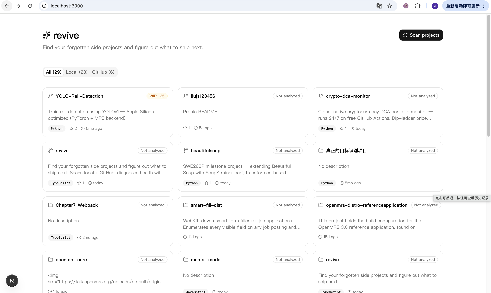
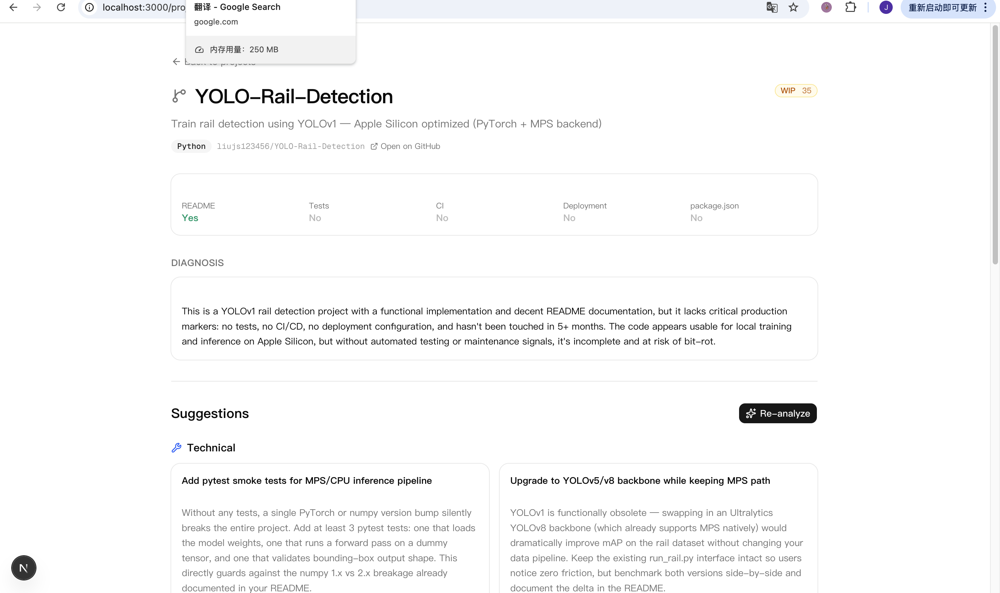

# revive

> Find your forgotten side projects and figure out what to ship next.

revive scans your local Desktop and your GitHub account for code projects, assesses each one's "health" with Claude, and generates concrete suggestions for what to build, fix, or polish next — across four dimensions: technical, features, resume polish, and pivot ideas.

Built for the developer who has 30 half-finished side projects and wants to revive the ones worth shipping.



---

## What it does

- **Scans** local directories (default: `~/Desktop`) and your GitHub repos for projects
- **Diagnoses** each project's state: `abandoned` / `wip` / `shipped` / `polished`, with a 0–100 health score
- **Suggests** 6 concrete next steps per project, split across:
  - **Technical** — tests, CI, refactors, dep upgrades
  - **Feature** — what to build to 10x usefulness
  - **Resume polish** — README, demo, deployment, screenshots
  - **Pivot** — bold reinventions for dead projects
- Each suggestion is tagged with **effort** (S/M/L) and **impact** (L/M/H)



## Stack

- **Next.js 16** (App Router, Turbopack) + **React 19** + **TypeScript**
- **Tailwind v4** + **shadcn/ui** for the dashboard
- **Anthropic SDK** — Claude Haiku 4.5 (fast diagnosis) + Sonnet 4.6 (suggestions)
- **Octokit** for GitHub scanning, **better-sqlite3** for local persistence

## Setup

```bash
git clone https://github.com/liujs123456/revive.git
cd revive
npm install
cp .env.example .env.local
```

Fill in `.env.local`:

```bash
ANTHROPIC_API_KEY=sk-ant-api03-...      # https://console.anthropic.com/settings/keys
GITHUB_TOKEN=github_pat_...             # https://github.com/settings/tokens?type=beta
                                        # Needs Contents:Read + Metadata:Read
GITHUB_USERNAME=your-handle
LOCAL_SCAN_PATH=/Users/you/Desktop      # or wherever your projects live
```

Then:

```bash
npm run dev
# open http://localhost:3000
```

First visit goes to a setup wizard — paste your Anthropic key + GitHub token, click Test on each, click Save. From then on you hit the dashboard directly.

Click **Scan projects** (first scan takes ~10–30s depending on # of GitHub repos). For projects you haven't analyzed yet, click **Analyze all** in the banner at the top of the dashboard, or open one project and click **Analyze with Claude** (~20s for 6 suggestions per project). Search + source/health filters help once you have many projects.

### One-click launch (macOS)

Tired of running `npm run dev` from a terminal every time? Build a Mac app launcher:

```bash
bash scripts/build-mac-app.sh
```

This creates `~/Applications/Revive.app`. Drag it to your Dock — clicking it starts the dev server and opens the dashboard in one step. If the server's already running, it just opens the browser.

## Cost

Per project analyzed: ~1–3¢ (Haiku diagnosis + Sonnet suggestions). $5 of credit covers 150–500 projects.

## Architecture

```
app/
  api/
    scan/route.ts                         POST — kicks off local + github scan
    projects/route.ts                     GET — list all projects
    projects/[id]/route.ts                GET — one project detail
    projects/[id]/analyze/route.ts        POST — diagnose + generate suggestions
  page.tsx                                Dashboard
  project/[id]/page.tsx                   Project detail
lib/
  scanner/local.ts                        Walks fs for project markers
  scanner/github.ts                       Lists GitHub repos via octokit
  analyzer/diagnose.ts                    Claude Haiku — health assessment
  analyzer/suggest.ts                     Claude Sonnet — 6 suggestions
  db.ts                                   SQLite persistence
  claude.ts                               Anthropic SDK wrapper
```

## Roadmap

- [x] Setup wizard (no more `.env.local` editing)
- [x] Bulk "Analyze all" with progress + cost estimate
- [x] Search + filter (source, health status)
- [x] Open local project in Finder
- [x] One-click Mac app launcher
- [ ] Render project README in detail view
- [ ] Cross-project insights ("you have 3 abandoned scrapers — consolidate?")
- [ ] VS Code / editor open buttons

## License

MIT
